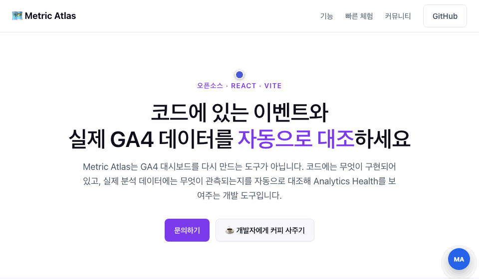

# Metric Atlas

**English** · [한국어](./README.ko.md)

[](https://www.npmjs.com/package/@metric-atlas/vite)
[](./LICENSE)
[](#quickstart)

**See which analytics events live in your code, where they are bound on screen, and whether GA4 actually observes them — automatically.**

Metric Atlas does not rebuild the GA4 dashboard. It compares **what is implemented in code** with **what is observed in analytics**, and surfaces the result as *Analytics Health*.



**▶ [Live demo](https://metric-atlas-homepage.fly.dev/)** — turn on the `MA` launcher (bottom-right) and hover the buttons.

## Why

- Event knowledge is scattered across code, docs, and analytics consoles — and docs go stale the moment code changes.
- Non-developers can't tell which on-screen element fires which event, so they keep asking developers.
- An event existing in code doesn't mean GA4 actually receives it — and data existing in GA4 doesn't mean the code still sends it.

Metric Atlas starts from **the implementation that already exists**:

```text
Existing Code → Event Detection → UI Binding → GA4 Observation → Analytics Health
```

## Features

### 🔍 Event Overlay — zero-server

At build time, Metric Atlas analyzes the AST for supported patterns (`gtag(...)`, `sendGAEvent(...)`, `dataLayer.push(...)`, `mixpanel.track(...)`) and injects `data-atlas-id` into the **build output only** — source files are never modified. On the deployed page, toggle the launcher and hover any bound element to see the event name, emitter/provider, source file and line, and parameters.

`dataLayer.push(...)` is detected as a GTM call and never assumed to target GA4.

### 📊 Analytics Health Dashboard

Served by the Node Runtime at `/__metric-atlas/dashboard`. The first view is **Code ↔ GA4 Health**, not a raw count table:

- events in code but not observed in GA4 (with data-quality caution, not a premature "bug" verdict);
- events observed in GA4 but missing from code — GA4 auto-collected events are classified separately so they don't pollute the list;
- custom parameters sent by code but **not registered as GA4 Custom Dimensions** (invisible in reports);
- healthy events, plus per-event counts and period comparisons.

### 🤖 Natural Language Query *(optional)*

Ask questions about your events in plain language. Answers are grounded in the same Health evidence the dashboard shows (code state, GA4 observation, latest counts) so the LLM never claims an event is "collecting fine" without data to back it up. Set a key in the Runtime environment — OpenAI or Anthropic — with `metric-atlas init-env` or `metric-atlas set-llm-key` (see [LLM setup](#natural-language-query-setup-llm-optional) below). Everything else — search, filters, Health — works without an LLM.

### ✅ PR Analytics Change Report — zero-server

GitHub Actions rescans base and head commits and comments the diff on every pull request. Git is the baseline; no database required. [Setup](#pr-analytics-change-report-setup) below.

```text
Metric Atlas Analytics Change

+ Added events: 3
- Removed events: 1
~ Changed emitter/provider: 0
! Dynamic/unresolved: 2
! Possible wrapper usage: 1
```

## Quickstart

```bash
npm install -D @metric-atlas/vite
```

```ts
// vite.config.ts
import { defineConfig } from "vite";
import react from "@vitejs/plugin-react";
import metricAtlas from "@metric-atlas/vite";

export default defineConfig({
  plugins: [
    metricAtlas({
      enabled: process.env.METRIC_ATLAS_ENABLED === "true",
      overlay: { enabled: true },
    }),
    react(),
  ],
});
```

```bash
METRIC_ATLAS_ENABLED=true npm run build
```

That's it for the Overlay — deploy the build output anywhere (it's fully static). On a host like Vercel, enable the flag on Preview builds only if you want production untouched.

Requirements: Node.js ≥ 22.18, a React + Vite project.

<details>
<summary>Advanced: track unreleased changes from <code>main</code></summary>

A self-contained build of the plugin is republished to the `dist/vite-plugin` branch on every push to `main` (see `docs/adr/ADR-008-standalone-vite-plugin-distribution.md`):

```bash
npm install "github:Metric-Atlas/Metric-Atlas#dist/vite-plugin"
```

For normal use, prefer the npm release above.

</details>

## Do I need a server?

**Not for the core.** The Overlay and the PR Report run with zero servers. A server enters the picture only for the **Analytics Health Dashboard** — GA4 must be queried with a credential, and that credential must never reach the browser, so the query has to run in a Node process you control.

| You have… | Overlay | PR Report | Health Dashboard |
|---|---|---|---|
| Static hosting only (S3/Vercel/Pages) | ✅ works as-is | ✅ works (runs in CI) | Run `metric-atlas serve` locally when you want to check, or host the Runtime separately and proxy `/__metric-atlas/*` to it |
| Your own server / reverse proxy (nginx, ALB, k8s) | ✅ works as-is | ✅ works | Add the Runtime as one internal service and route `/__metric-atlas/*` to it — one proxy rule, existing deployment untouched |
| No server yet | ✅ | ✅ | `npx metric-atlas serve ./dist` is the only server you need — it serves your site, the dashboard, and the GA4 proxy in a single Node process (no database) |

The adoption ladder most teams follow:

```text
1. Plugin only            → Overlay                    (no server)
2. + CLI in CI            → PR Analytics Report        (no server)
3. + occasional local serve → Health when you need it  (no server hosted)
4. + hosted Runtime       → always-on team dashboard   (one small Node process)
```

## Analytics Health setup (GA4)

The browser never calls GA4 directly. Credentials live only in the Runtime process.

1. Create a Google Cloud service account, download its JSON key, and add it to your GA4 property as **Viewer**.
2. Keep the key outside the repository, then create a Runtime env file:

```bash
cat > .env.metric-atlas <<'EOF'
METRIC_ATLAS_GA4_PROPERTY_ID=123456789
GOOGLE_APPLICATION_CREDENTIALS=/absolute/path/to/service-account.json
EOF
```

Prefer not to hand-write it? Once the CLI is installed (step 3 below), `metric-atlas init-env --ga4-property-id 123456789 --google-application-credentials /absolute/path/to/service-account.json` generates the same file, including sane defaults for the health lookback window and cache TTL (see the [environment variable reference](#runtime-environment-variables-reference)).

3. Build and serve:

```bash
npm install -D @metric-atlas/cli
METRIC_ATLAS_ENABLED=true npm run build
npx metric-atlas serve ./dist --env ./.env.metric-atlas --port 8787
```

Open `http://127.0.0.1:8787/__metric-atlas/dashboard` (path configurable via `--dashboard-path`). Verify with:

```bash
curl http://127.0.0.1:8787/__metric-atlas/api/runtime-health
curl http://127.0.0.1:8787/__metric-atlas/api/health
```

**Deploying the Runtime:** if the platform supports only environment variables, store the key as base64 in `METRIC_ATLAS_GA4_SERVICE_ACCOUNT_JSON_BASE64` instead — the Runtime reads it directly. Grant the service account the minimum read permission on the target property only. Never put GA4 credentials in `VITE_*`, browser storage, source code, build output, or logs. Metric Atlas ships no built-in authentication — restrict dashboard access at the network or hosting layer.

## Natural language query setup (LLM, optional)

Add a key to the same `.env.metric-atlas` created above, without ever pasting the secret into a file (`--key-env` reads it from a shell variable you already have set; `--key-stdin` reads it from stdin):

```bash
export MY_OPENAI_KEY=sk-...
npx metric-atlas set-llm-key --key-env MY_OPENAI_KEY
```

Anthropic (Claude) works the same way — pass `--provider anthropic` and the matching key:

```bash
export MY_ANTHROPIC_KEY=sk-ant-...
npx metric-atlas set-llm-key --key-env MY_ANTHROPIC_KEY --provider anthropic
```

Restart `metric-atlas serve` (or redeploy the Runtime) and it picks up the new key. Any OpenAI-compatible gateway (OpenRouter, a self-hosted model, etc.) also works via `--base-url`:

```bash
npx metric-atlas set-llm-key --key-env MY_KEY --base-url https://openrouter.ai/api/v1 --model openrouter/some-model
```

Prefer setting the env vars directly instead of using the CLI? `METRIC_ATLAS_LLM_API_KEY` (or `OPENAI_API_KEY`), `METRIC_ATLAS_LLM_PROVIDER` (`openai` default, or `anthropic`), `METRIC_ATLAS_LLM_BASE_URL`, `METRIC_ATLAS_LLM_MODEL` — full reference [below](#runtime-environment-variables-reference).

## PR Analytics Change Report setup

Zero server, zero credentials — it only reads two Git refs and comments the diff. Add `@metric-atlas/cli` to any workflow that runs on `pull_request`:

```yaml
# .github/workflows/metric-atlas-report.yml
name: Metric Atlas Analytics Report

on:
  pull_request:

permissions:
  contents: read
  pull-requests: write

jobs:
  report:
    runs-on: ubuntu-latest
    steps:
      - uses: actions/checkout@v4
        with:
          fetch-depth: 0 # full history so both refs below can be diffed

      - uses: actions/setup-node@v4
        with:
          node-version: 22.18.0

      - run: npm install -D @metric-atlas/cli

      - run: |
          npx metric-atlas report \
            --base-ref ${{ github.event.pull_request.base.sha }} \
            --head-ref ${{ github.event.pull_request.head.sha }} \
            --output metric-atlas-report.md

      - uses: actions/github-script@v7
        with:
          script: |
            const fs = require("node:fs");
            await github.rest.issues.createComment({
              owner: context.repo.owner,
              repo: context.repo.repo,
              issue_number: context.issue.number,
              body: fs.readFileSync("metric-atlas-report.md", "utf8"),
            });
```

`metric-atlas report` reads the base/head Git trees directly (via `git show`) — it never checks out either commit or touches your working tree, and it never needs the Vite plugin or a build step. Only the GA4/GTM detectors run by default; add others with `--detectors`. For a version that updates the same PR comment instead of posting a new one every push, see this repo's own `.github/workflows/metric-atlas-analytics-report.yml` and `.github/actions/analytics-report/action.yml`.

## Runtime environment variables (reference)

Every variable below is read by the Node Runtime process only (`metric-atlas serve`, or the scanner for the first block) — never by the browser bundle. `metric-atlas init-env` writes a `.env.metric-atlas` file with the GA4 and LLM rows pre-filled at these same defaults.

| Variable | Default | Purpose |
|---|---|---|
| `METRIC_ATLAS_GA4_PROPERTY_ID` | *(none)* | GA4 property to query. Required for live Health data. |
| `METRIC_ATLAS_GA4_SERVICE_ACCOUNT_JSON_BASE64` | *(none)* | Service account JSON, base64-encoded. Use this **or** the variable below — whichever your host supports. |
| `GOOGLE_APPLICATION_CREDENTIALS` | *(none)* | Absolute path to the service account JSON file on disk. |
| `METRIC_ATLAS_GA4_HEALTH_WINDOW_DAYS` | `30` | How many days of GA4 data the Health report covers. |
| `METRIC_ATLAS_GA4_RECENT_WINDOW_HOURS` | `48` | Events observed within this window are flagged "recent data may still change" instead of treated as final. |
| `METRIC_ATLAS_CACHE_TTL_SECONDS` | `300` | How long a computed Health report stays cached in memory before the Runtime queries GA4 again. |
| `METRIC_ATLAS_LLM_API_KEY` (or `OPENAI_API_KEY`) | *(none)* | LLM key. Without it, natural language query is disabled — everything else keeps working. |
| `METRIC_ATLAS_LLM_PROVIDER` | `openai` | `openai` or `anthropic`. |
| `METRIC_ATLAS_LLM_BASE_URL` | provider default | Override to point at an OpenAI-compatible gateway (OpenRouter, a self-hosted model, etc.) or Anthropic's endpoint. |
| `METRIC_ATLAS_LLM_MODEL` | provider default | Model name. |
| `METRIC_ATLAS_LLM_MAX_CANDIDATES` | `20` | Max number of candidate events sent to the LLM per question. |
| `METRIC_ATLAS_LLM_TIMEOUT_MS` | `10000` | LLM request timeout, in milliseconds. |
| `METRIC_ATLAS_RUNTIME_HOST` | `127.0.0.1` | Bind address. Set to `0.0.0.0` (or pass `--host 0.0.0.0`) for the Runtime to be reachable from outside its own container. |
| `METRIC_ATLAS_RUNTIME_PORT` | `8787` | Listen port (or pass `--port` instead). |
| `METRIC_ATLAS_DASHBOARD_PATH` | `/__metric-atlas/dashboard` | Path the embedded dashboard is served at (or pass `--dashboard-path` instead). |

## Try the demo locally

No API key needed — fixtures included:

```bash
git clone https://github.com/Metric-Atlas/Metric-Atlas.git && cd Metric-Atlas
corepack pnpm install --frozen-lockfile
corepack pnpm demo
```

The demo app showcases supported patterns (inline `gtag`, same-file handlers, `dataLayer.push`) and deliberately unsupported ones (wrapper calls → warning, custom components → detected but no overlay, dynamic event names → `unresolved`).

## What Metric Atlas is not

Not an event-approval/governance SaaS, not a BI tool, not a GA4 replacement, and not a tracking-plan validator — tools in that category start from a human-authored plan; Metric Atlas starts from your code.

## Architecture in one paragraph

A Vite plugin (Babel AST) scans your source at build time and emits an event manifest; an overlay Web Component reads it on the page. A single Node Runtime (no database, in-memory cache) serves the site, the embedded dashboard, and a GA4 Data/Admin API proxy — credentials stay server-side, responses are cached and rate-guarded. Design records live in [`docs/`](./docs) (start with [`docs/00-project-source-of-truth.md`](./docs/00-project-source-of-truth.md) and the decision log in [`docs/15-decision-log.md`](./docs/15-decision-log.md)).

## Contributing

Contributions are welcome — read the [Contributing Guide](./CONTRIBUTING.md) ([한국어](./CONTRIBUTING.ko.md)) first.

## License

[MIT](./LICENSE). Published `@metric-atlas/*` packages follow [Semantic Versioning](./docs/18-positioning-and-open-source.md#4-public-release-gate) (pre-1.0: breaking changes may land in minors). Security reports: [`SECURITY.md`](./SECURITY.md) · Maintainers: [`MAINTAINERS.md`](./MAINTAINERS.md) · Dependency licenses: [`THIRD-PARTY-NOTICES.md`](./THIRD-PARTY-NOTICES.md)
