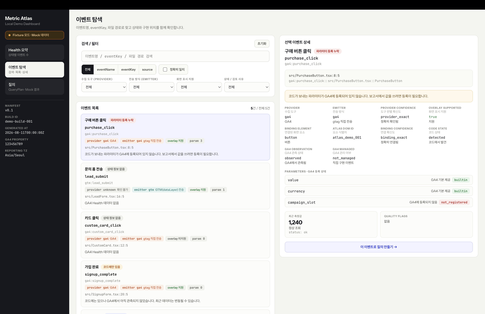
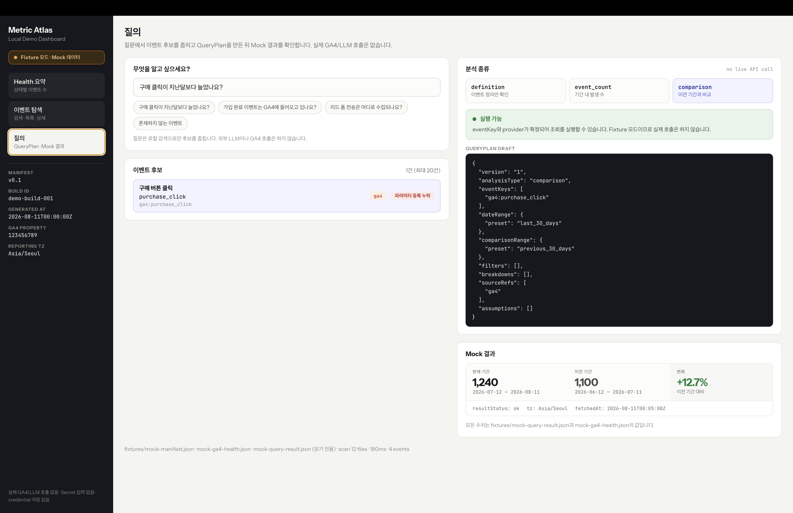

# @metric-atlas/demo-react-vite

Runtime 우선 + Fixture fallback 기반 Local Demo Dashboard입니다. Vite dev server의 실제 Detector Manifest를 Overlay와 Dashboard가 소비하고, Health/Query Runtime artifact가 없으면 저장된 fixture로 안전하게 fallback합니다.
실제 GA4·LLM 호출, Secret 입력 UI, credential 저장은 없습니다.

## 실행

```bash
corepack pnpm install
corepack pnpm --filter @metric-atlas/demo-react-vite dev        # http://localhost:5180
corepack pnpm --filter @metric-atlas/demo-react-vite test
corepack pnpm --filter @metric-atlas/demo-react-vite typecheck
corepack pnpm --filter @metric-atlas/demo-react-vite build
corepack pnpm test:e2e
```

workspace 인식이 안 되면 repo 루트 `pnpm-workspace.yaml`에 `apps/*`를 추가하세요.

```yaml
packages:
  - packages/*
  - apps/*
```

repo 루트 script 예시 (선택):

```json
{
  "scripts": {
    "demo": "corepack pnpm --filter @metric-atlas/demo-react-vite dev"
  }
}
```

## Screenshots

| Health 요약 | 이벤트 탐색 | 질의 |
| --- | --- | --- |
|  |  |  |

## 데이터

| 파일 | 용도 |
| --- | --- |
| `fixtures/mock-manifest.json` | 이벤트 / binding / scanStats |
| `fixtures/mock-ga4-health.json` | Health summary / item / 측정값 |
| `fixtures/mock-query-result.json` | QueryPlan + comparison 결과 |

fixture는 **읽기 전용**입니다. 변경 없음.

## Overlay

Demo App은 `@metric-atlas/vite`를 사용해 source를 수정하지 않고 build output에만 `data-atlas-id`를 주입합니다. 화면의 `GA4 demo event`와 `GTM demo event`는 외부 전송 없이 브라우저 CustomEvent만 발생시키는 탐지/Overlay showcase입니다. Production build의 `.metric-atlas/manifest.json`은 `metric-atlas serve ./dist`가 `/__metric-atlas/api/manifest`로 제공합니다.

## 구조

```
src/
  data.ts        fixture import, eventKey join, health bucket 판정
  search.ts      exact/fuzzy 검색, 필터, 질의 후보 축소(최대 20)
  queryPlan.ts   QueryPlan draft 생성, 실행 가능/차단 판정, mock 결과 매칭
  labels.ts      한국어 매핑(이벤트 설명·필드 용어·값 뜻)과 색상 토큰
  ui.ts          공용 inline style
  components/    Sidebar, EventCard, EventDetail
  views/         OverviewView(Health 요약), EventsView(탐색), QueryView(질의)
```

## 한국어 매핑 원칙

- 원본 `eventName`, `eventKey`, source path는 번역하지 않고 monospace로 그대로 표시합니다.
  한국어는 **병기**입니다. (`purchase_click` → "구매 버튼 클릭" 라벨을 함께 노출)
- 필드명은 영어(`CODE STATE`), 그 아래 마케터 용어(코드 상태), 값은 원천 값 + 한국어 뜻을 함께 표시합니다.
- `EMITTER`는 전송 방식 사전을 따로 씁니다: `ga4` → "gtag 직접 전송", `gtm` → "GTM(dataLayer) 전송".
  GA4와 GTM을 같은 개념으로 취급하지 않습니다. `dataLayer.push`는 GTM Emitter이며 provider는 `unknown`입니다.
- 매핑은 `src/labels.ts`에만 있고 fixture에는 넣지 않습니다.

## 상태 판정

버킷 우선순위: `unresolved > parameterRegistrationGap > codeOnly > ga4Managed > ga4Only > healthy`.
Health에만 있는 이벤트(`ga4:page_view`)는 "코드 미탐지" 행으로 목록에 남겨 GA4 only 상황을 드러냅니다.

## 실행 차단 규칙 (Query)

- 후보 없음 → 차단
- 후보 여러 개 & 미선택 → 자동 선택하지 않고 사용자 선택 요구
- `analyticsProvider = unknown` (GTM 전송) → 차단
- 코드 미탐지 이벤트 → 차단
- `definition` → GA4 요청 없음("실행 불필요")
